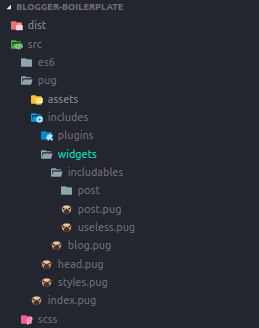

# blogger-boilerplate
A custom boilerplate to develop custom blogger templates using pug and scss modules.

# How to install
Just download or clone this repo and install dependencies.
```bash
npm install
```
**pnpm**
```bash
pnpm install
```
# What can you do?
Using this boilerplate allows you to use custom **pug** and **sass** modules.



This way you can create scalable templates with the benefits of these 2 languages.

## Compile
Just run the following.
```sh
gulp || npm start
```
You can compile just the template.
```sh
npm run gulp
```
Styles: `npm run sass`

JavaScript: `npm run babel`